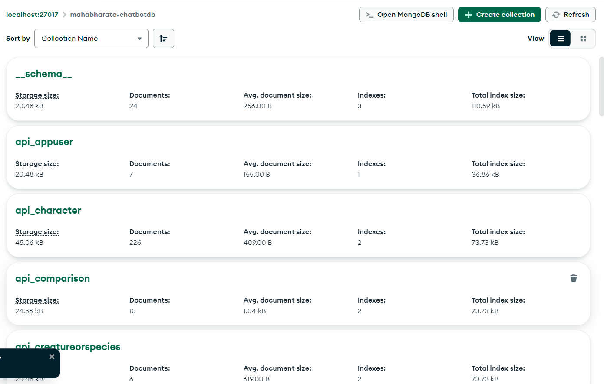

# Mythology Chatbot

## Project Overview
This project is a mythology-based chatbot that utilizes NLP techniques to provide responses based on user queries. It includes both a backend powered by Django and machine learning models and a frontend built with React.

---

## Backend Setup

### Prerequisites
- Python 3.x
- MongoDB installed and running
- Necessary Python dependencies

### Installation and Running the Backend
```sh
cd backend
python -m venv venv  # Create a virtual environment
source venv/bin/activate  # Activate it (Mac/Linux)
venv\Scripts\activate  # Activate it (Windows)

pip install -r requirements.txt  # Install dependencies

python manage.py migrate  # Apply migrations
python manage.py runserver  # Start the server
```

### Backend Terminal Output


### MongoDB Setup
Ensure MongoDB is running and properly configured.



---

## Frontend Setup

### Prerequisites
- Node.js installed

### Installation and Running the Frontend
```sh
cd frontend
cd mahabharat-chat
npm install  # Install dependencies
npm run dev  # Start the frontend server
```

### Frontend Screenshots

#### Authentication Page


#### Main Page


#### Profile Page


---

## Features
- NLP-based chatbot using ML models
- User authentication
- Interactive frontend UI
- MongoDB integration for data persistence

## Tech Stack
- **Backend:** Django, Scikit-learn, Spacy, NLTK, MongoDB
- **Frontend:** React, Tailwind CSS

## License
This project is licensed under the MIT License.

